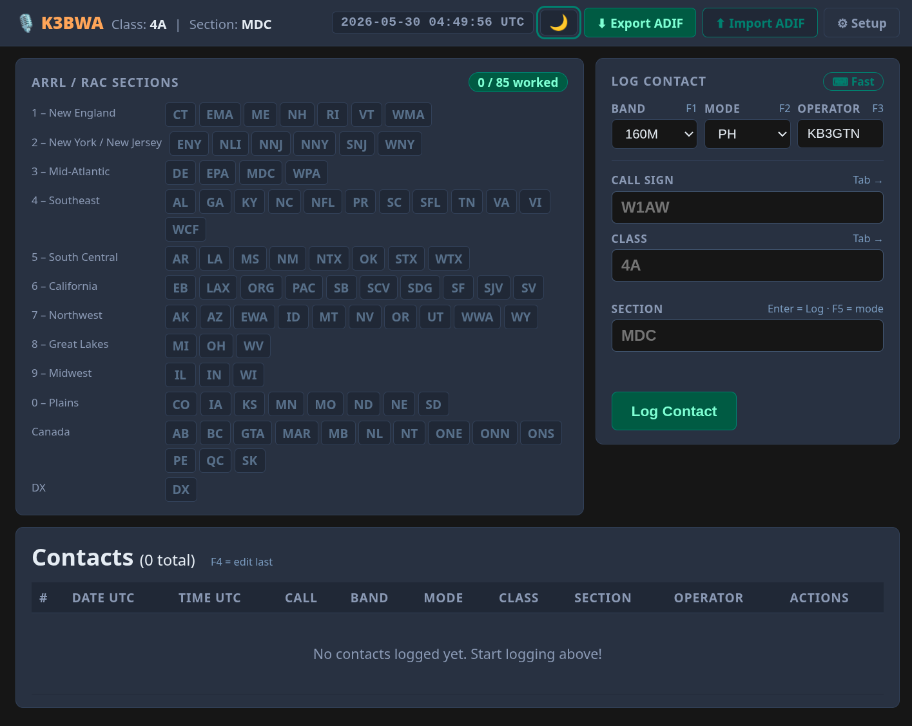
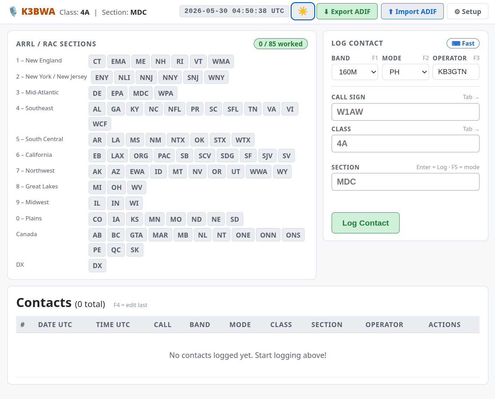
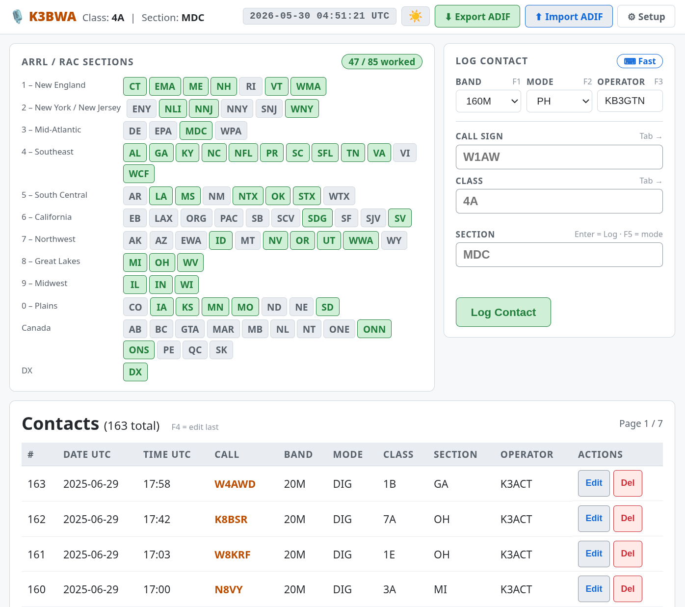

# FD Logger

A web-based contact logger for the ARRL Field Day amateur radio contest.
Runs as a standalone local web server — no internet connection required.
Multiple operators can log contacts simultaneously from any browser on the local network.

## Screenshots

### Setup Screen


### Main Display – Dark Mode


### Main Display – Light Mode


### Main Display – With Contacts


## Features

- **Fast contact entry** — Tab cycles through Call / Class / Section; Enter submits
- **Duplicate checking** — warns on (call, band, mode) duplicates per Field Day scoring rules
- **ARRL / RAC sections grid** — all sections shown with worked / unworked status, tooltips, live count
- **N1MM+ integration** — listens and broadcasts UDP contact messages on port 12060
- **ADIF import / export** — import existing logs; export for submission or third-party software
- **Accessibility** — ARIA landmarks, live regions, focus management, screen-reader announcements
- **Keyboard shortcuts**
  - `F1` — cycle band
  - `F2` — cycle mode (PH / CW / DIG)
  - `F3` — focus operator field
  - `F4` — edit last logged contact
  - `F5` — toggle fast-entry / navigation mode
  - `Esc` — clear the log entry form (fast-entry mode)
- **Dark / light theme** — toggle in the header; preference saved across sessions
- **Single binary** — SQLite is bundled; copy the binary and `templates/` directory to deploy

## Requirements

- Rust 1.75 or later
- Cargo

## Building

```bash
git clone git@github.com:kb3gtn/FD_LOGGER.git
cd FD_LOGGER
cargo build --release
```

The release binary is written to `target/release/fd_logger`.

## Running

```bash
# From the project directory (templates/ must be alongside the binary)
./target/release/fd_logger
```

The server starts on `http://0.0.0.0:8000`. Open a browser on any machine on the
local network and navigate to `http://<host-ip>:8000`.

On first launch you will be prompted to enter your station callsign, Field Day class,
and section. This information is stored in the database and included in all exported logs.

### N1MM+ broadcast address

By default UDP messages are broadcast to `255.255.255.255`. Override with an environment
variable if your network requires a specific subnet broadcast address:

```bash
N1MM_BROADCAST=192.168.1.255 ./fd_logger
```

## Deployment

Copy these two items to any directory and run the binary from there:

```
fd_logger          (binary)
templates/         (HTML templates directory)
```

The SQLite database (`fd_logger.db`) is created automatically in the working directory
on first run.

## Bands supported

160M / 80M / 40M / 20M / 15M / 10M / 6M / 2M / 70CM

## Modes supported

| Log entry | ADIF export |
|-----------|-------------|
| PH        | SSB         |
| CW        | CW          |
| DIG       | DIG         |

## ADIF Import

Contacts are imported from `.adi` / `.adif` files via the **⬆ Import ADIF** button in
the header. Duplicates on (call, band, mode) are skipped automatically.

Fields read from ADIF: `CALL`, `BAND`, `MODE`, `QSO_DATE`, `TIME_ON`, `CLASS`,
`ARRL_SECT`, `SRX_STRING`, `OPERATOR`.

## License

GNU General Public License v3.0 — see [LICENSE](LICENSE) for details.
